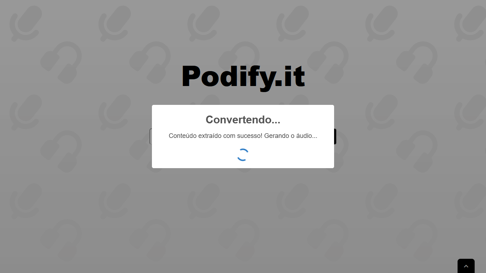
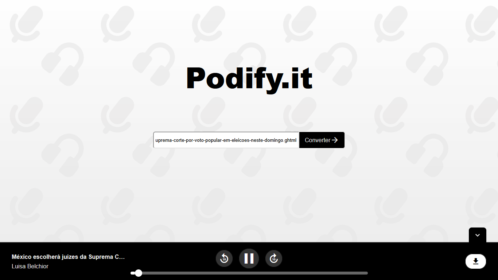

# 🎧 Podify.it

**Podify.it** é uma plataforma que transforma qualquer artigo da web em um episódio de podcast.

O projeto nasceu da necessidade de consumir conteúdo de forma mais flexível — durante deslocamentos, atividades físicas ou tarefas cotidianas — sem depender exclusivamente da leitura.

---

## 🖼️ Screenshots

### Página inicial


### Gerando áudio


### Tocando o áudio


---

## 🛠️ Stack utilizada

O projeto foi desenvolvido com as seguintes tecnologias:

### 🎨 Front-end
- **Angular 17**
- **PrimeNG**
- **PrimeFlex**
- **Material UI**

### 🧠 Backend
- **Python 3.12**
- **Flask**
- **BeautifulSoup4**
- **OpenAI API**

### 📦 Infraestrutura
- **Docker**

---

## ⚙️ Instalação Local

### ✅ Pré-requisitos

- Uma conta na [OpenAI](https://platform.openai.com/signup) com créditos disponíveis
- Uma **API Key** válida da OpenAI
- [Docker](https://www.docker.com/) instalado em sua máquina

---

### 🔐 Configurando as variáveis de ambiente

1. Copie sua chave de API da OpenAI.
2. Navegue até a pasta `/backend`.
3. Faça uma cópia do arquivo `.env.example` e renomeie-a para `.env`.
4. Substitua o valor da variável `OPENAI_API_KEY` pela sua chave, **sem alterar a estrutura do arquivo**.

---

### 🐳 Executando com Docker

No terminal, na raiz do projeto, execute:

```bash
docker build -t podify.it .
docker run -p 5000:5000 -p 4200:4200 podify.it
```

---

## 📄 Licença

Este projeto está licenciado sob a licença MIT. Veja o arquivo [LICENSE](./LICENSE) para mais detalhes.

---

## 👨‍💻 Autor

Desenvolvido por **Hugo Hanashiro Galdino**  
[LinkedIn](https://www.linkedin.com/in/hugo-hanashiro/) • hugohanashirogaldino@gmail.com
